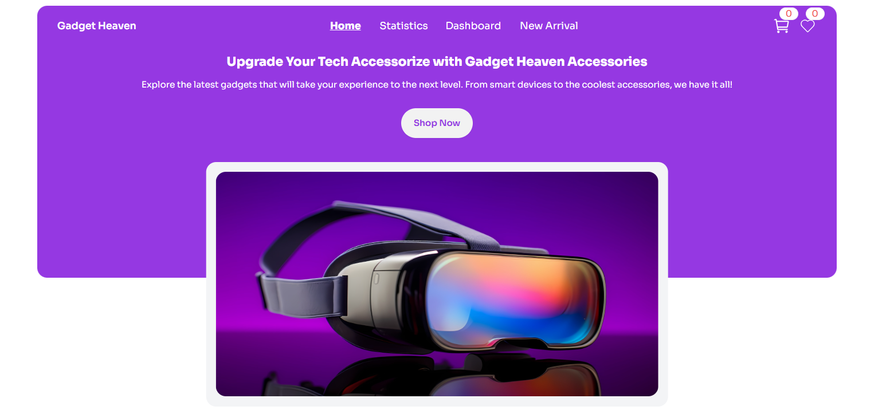

# :star: Gadget Heaven
   
___
## Live site :- [Gadget Heaven](https://gadget-heaven88.netlify.app/)
## Requirement Document Link :- [Document](https://github.com/ProgrammingHero1/B10-A8-gadget-heaven/blob/main/Batch-10_Assignment-08.pdf)
## :book: About the project:-
> Gadget-Heaven, a gadget-buying website .It has  structured
navigation bar, product categories, and individual product details pages which ensures a smooth user experience.
### React Fundamental concepts  used in the Project  
- useState & useOutletContext (For handling & managing data )
- useEffect
- Outlet
- React Router
## :rocket: Features:-
- A wishlist system.
- A shopping cart.
- product filtering.
- Different Toast message on different action.
- Dynamically fetch data and show data.

## technology
- React
- React Router
- Tailwind
- Daisy ui
 
